# genomeblocks benchmarks

How fast each building block is against the tools people would otherwise use, why, and where it is still slow. Open `report/index.html` for the full interactive report (charts, mechanism diagrams, every table).

Machine: Intel(R) Xeon(R) Processor @ 2.10GHz, 4 cores, 17 GB RAM, Python 3.11.16. Medians of 3–5 runs after a warm-up; every comparison is checked for identical output first.

## Headlines

| block | result | context |
|---|---|---|
| Loci | **2.3 µs** · Overlap lookup | per query on 100k indexed peaks: 494× faster than pyranges, 2,776× faster than bioframe |
| signal | **72×** · Heatmap matrix from bigWigs | faster than deepTools computeMatrix on one core (12k vs 173 regions/s); 396× faster than pyBigWig's binned stats() |
| Atlas | **21 ms** · Enrichment vs 500 peak files | per 20k-peak query with Fisher tests: 63× faster than GIGGLE, 189× faster than looping over tracks |
| motifs | **26×** · Motif scanning | faster than MEME FIMO, 52× faster than Biopython; 0.3 Gbp·motif/s on one core |
| bedpe | **780k/s** · Hi-C pair counting, with the fix | window × window matrix after a measured fix: 15× faster than today and 1.2× faster than cooler cload (today it is 12× slower) |
| Architecture | **185×** · Graph annotation step | faster than the per-vertex loop it replaced (74 ms vs 14 s on 114,367 edges) |

## Figures

**One overlap lookup**

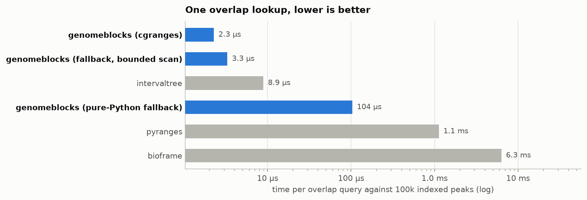

**Whole-set intersect**

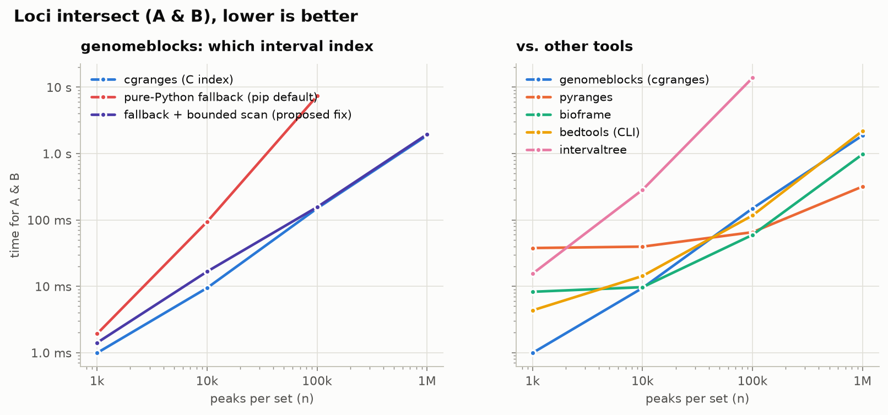

**bigWig → heatmap matrix, one core**

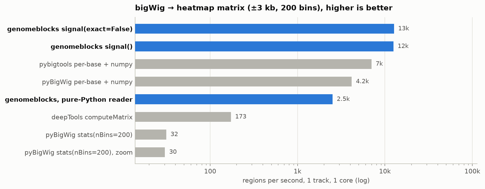

**Throughput vs loci**

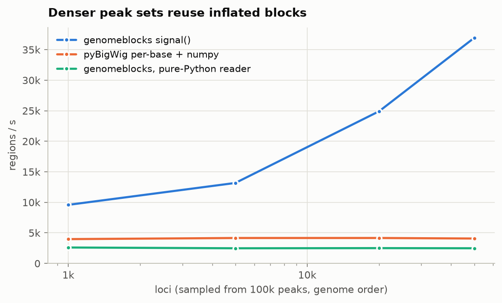

**Processes vs threads vs deepTools**

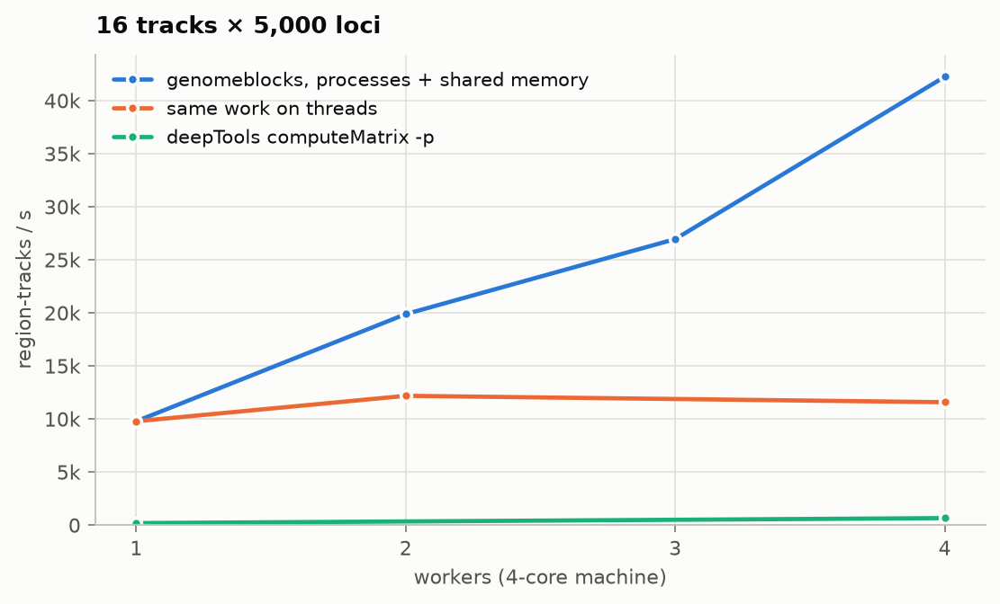

**Atlas vs GIGGLE vs per-track loops**

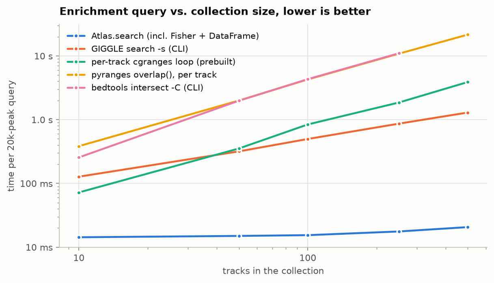

**Motif scanning engines**

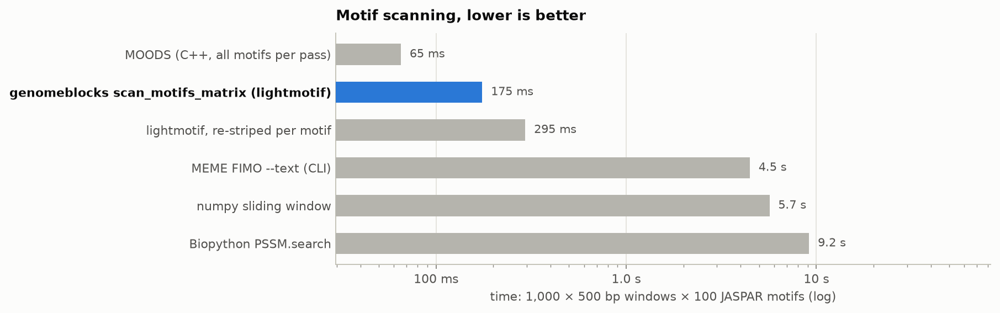

**Hi-C pair counting**

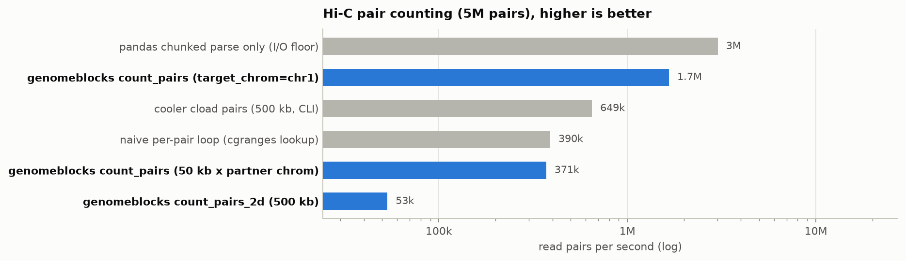

**Gene-model steps**

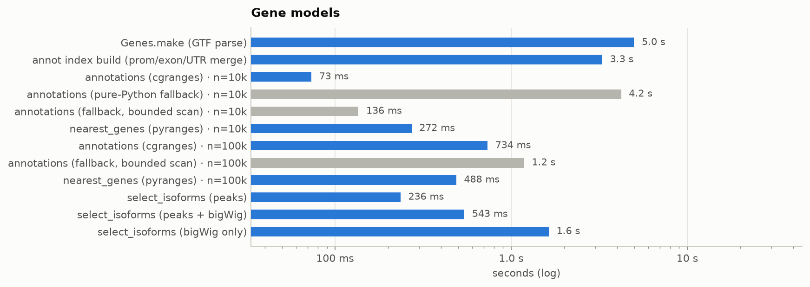

**Architecture pipeline**

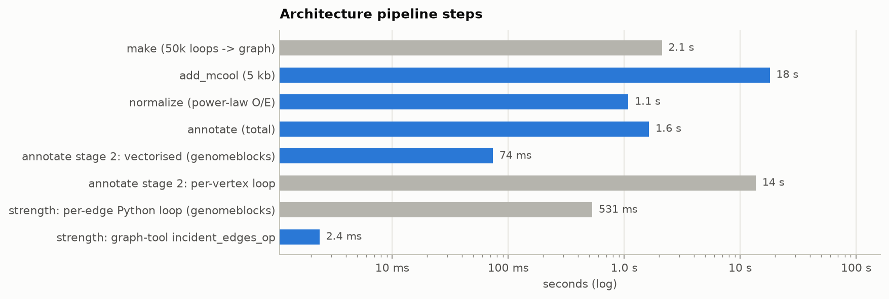

**Import cost**

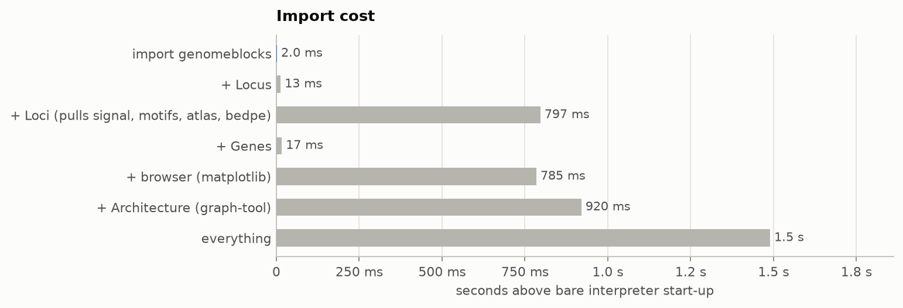

## Where it is slow, and the fix

- **pip installs get a quadratic overlap index** cgranges is not on PyPI, so pip users get `_PyIntervalIndex`. Its `overlap()` walks every interval that starts before the query end (`range(hi)` from 0), so each lookup is O(n) and `A & B` is O(n·m): 7.3 s at 100k peaks, roughly 12.2 min projected at 1M. Tracking the longest interval per chromosome and starting the walk at `bisect_left(starts, qs - max_len)` gives identical results in 156 ms (47× faster). The benchmark's `BoundedPyIndex` is a drop-in.

- **Loci.sort() / merge() compare dataclasses in Python** `sort()` calls `sorted(s)`, which runs `Locus.__lt__` in Python for every comparison. On 2,000,000 intervals that is 13 s; `sorted(s, key=lambda l: (l.chrom, l.start))` gives the same order (checked: identical) in 7.4 s (1.7×). `merge()` goes from 15 s to 5.4 s (2.8×, identical output). pyranges still merges the same set in 151 ms; a numpy merge over start/end arrays would close the rest.

- **signal(): workers are capped at half the cores** `signal()` caps `workers` at `cpu_count() // 2`, so on this 4-core machine `workers=4` silently runs 2 processes (20k/s). Lifting the cap gave 42k/s (2.1× more). Consider honouring an explicit `workers` request and only defaulting to half.

- **pybigtools deprecates `missing=`** pybigtools 0.3 warns on every `values(..., missing=...)` call that the argument is deprecated in favour of `fillna`. `_PyBigToolsHandle` uses it on the hot path, so a future pybigtools release will break `signal()`. Switching to `fillna` (with a version check) avoids that.

- **pure-Python bigWig reader: keep it, it is close** The fallback reader manages 2.5k regions/s, 80× faster than pyBigWig's binned stats. Most of its time is the per-call R-tree walk and block inflate; caching the last inflated block per handle (as pybigtools does) would help the dense-peak case most.

- **count_pairs / count_pairs_2d compare chromosome strings per chunk** Each chunk's chromosome columns become Python strings and are compared against every chromosome (2-D: every chromosome pair). With integer category codes and one global `searchsorted` per anchor: `count_pairs` 13 s → 4.0 s, `count_pairs_2d` 94 s → 6.4 s on 5M pairs, identical output (checked).

- **Architecture.strength() and add_mcool() loop in Python** `strength()` walks every edge in Python (531 ms); `gt.incident_edges_op(G, 'out', 'sum', G.ep[key])` returns the same sums in 2.4 ms. `add_mcool` (18 s) does a pandas MultiIndex lookup per edge; joining the edge bin pairs against the pixel table in one merge would follow the pattern `annotate` already uses.

- **Touching Loci imports matplotlib, pandas and scipy** `import genomeblocks` is lazy (2.0 ms), but `from genomeblocks import Loci` takes 797 ms because `loci.py` imports every module that attaches methods, and those import their heavy dependencies at module level: `signal_draw` 315 ms, `bedpe` 157 ms, `atlas` 109 ms (cumulative, `python -X importtime`). Moving `matplotlib.pyplot`, `pandas` and `scipy.sparse` imports inside the functions that use them keeps the method attachment and removes most of that cost.

- **scan_motifs_matrix: one Python-level scan per window × motif** For 1,000 windows × 1,019 motifs that is 1,019,000 calls into lightmotif, each on only 500 bp, so call overhead dominates (1.5 s). Concatenating the windows, striping once, and scoring each motif over the whole block with `pssm.calculate(striped).threshold(t)` (hits split back per window with `np.bincount`, edge-crossing hits dropped) gives identical counts in every cell in 1.0 s (1.5×). MOODS still takes only 574 ms: the rest of the gap is the scoring itself, since lightmotif scores every position for every motif while MOODS skips most positions with a lookahead filter.

- **Small API papercut: numpy integers as Loci indexes** `Loci[np.int64(3)]` raises `TypeError` because `__getitem__` only accepts `int`. Checking `isinstance(key, numbers.Integral)` (or `operator.index`) lets index arrays from numpy work directly.

## Reproduce

```bash
cd benchmarks
python make_data.py            # synthetic hg38-shaped data, ~1.5 GB
PY=python ./run_all.sh         # every bench (one at a time), then figures
python build_report.py         # report/index.html + this README
```

External baselines are found on `PATH` (bedtools, deepTools `computeMatrix`, cooler, bgzip) or via `GIGGLE=` / `FIMO=` (GIGGLE built from github.com/ryanlayer/giggle; MEME suite from bioconda: `micromamba create -n tools -c conda-forge -c bioconda meme`). `Architecture` needs graph-tool (conda-forge).

Versions: numpy 2.4.6, scipy 1.17.1, pandas 3.0.6, pybigtools 0.3.0, pyBigWig 0.3.26, pyranges 0.1.4, bioframe 0.8.0, lightmotif 0.10.0, Bio 1.88, graph_tool 3.9, bedtools v2.31.1, cgranges (git), MOODS-python 1.9, deepTools 3.5.6, cooler 0.10.
