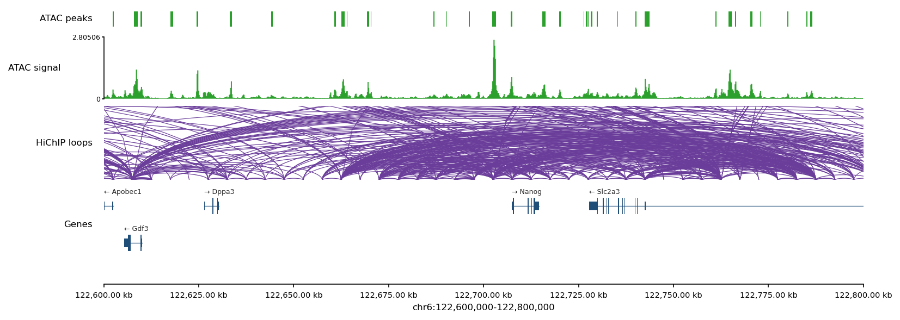

# Browser
{: .no_toc }

An IGV-like, fully-vectorial, matplotlib-native region viewer. One call dispatches across bigWig / narrowPeak / BED / BEDPE / Genes and renders publication-ready SVG or PDF.
{: .fs-5 .fw-300 }

## Table of contents
{: .no_toc .text-delta }

1. TOC
{:toc}

---

## One-call API

```python
from genomeblocks import browser, Loci, Genes
from genomeblocks.bedpe import read_bedpe

fig, axes = browser(
    region=("chr6", 122_600_000, 122_800_000),
    tracks={
        "HiChIP loops": read_bedpe("loops.bedpe"),
        "ATAC signal":  "ATAC.bw",
        "ATAC peaks":   Loci.make("peaks.narrowPeak"),
        "Genes":        Genes.make("gencode.v38.gtf"),
    },
    figsize=(12, None),      # height auto-sized to track count
    bw_n_bins=120,
    colors={"HiChIP loops": "#DA0000",
            "ATAC signal":  "#4c78a8"},
    bw_ymax={"ATAC signal": 150.0},
)
fig.savefig("region.svg")
```

Track *type* is auto-detected from:

| Source | Rendered as |
|---|---|
| `*.bw`, `*.bigwig` | binned coverage (fill_between + outline) |
| `list[str]` of bigWigs | **one averaged coverage track** (replicate grouping) |
| `*.bam` | per-base coverage with IGV-style reference-mismatch coloring (needs `reference`) |
| `*.narrowPeak`, `*.bed` / `Loci` | rectangle rows |
| `*.bedpe` / `list[Pair]` | half-sine arcs between anchors |
| `Genes` | stacked gene models (thin body line, exon boxes, taller CDS boxes, optional label & strand arrow) |

---

## BAM tracks & the reference sequence

Pass an indexed FASTA (`reference=`) to enable BAM coverage with mismatch
coloring and a reference-sequence track under the ruler:

```python
fig, axes = browser(
    "chr7:5,527,000-5,530,000",
    tracks={"WGS": "sample.bam", "peaks": "peaks.narrowPeak"},
    reference="hg38.fa",          # .fa + .fai — required for any .bam track
    bam_min_baseq=15,             # IGV default
    bam_allele_freq=0.2,          # colour a position once ≥20% of reads mismatch
    show_sequence=True,           # colored bases (≤200 bp) / strip (≤5 kb) above the ruler
)
```

BAM tracks need a coordinate-sorted `.bam` with a `.bai` index alongside, and
`pysam` (`pip install genomeblocks[bam]`). Total depth is a gray step; positions
above `bam_allele_freq` get nucleotide-colored mismatch bars.

---

## Region specification

Any of:

```python
region = "chr6:122,600,000-122,800,000"
region = ("chr6", 122_600_000, 122_800_000)
region = some_locus                   # Locus → .chrom/.start/.end
```

Commas and spaces are stripped from string forms.

---

## Styling knobs

- `track_heights={name: float}` — per-track height in inches (defaults: bw=0.5, bam=0.6, peaks=0.2, bedpe=1.5, genes=1.5).
- `colors={name: "#hex"}` — per-track color override.
- `bw_n_bins=N` — bin count per bigWig track (larger → finer detail, slower reads).
- `bw_ymax` — a **scalar** (all bigWig tracks) or a `{name: y}` dict; otherwise auto-scaled. `bam_ymax` does the same for BAM depth.
- `bw_share=[["AR 0h", "AR 4h"]]` — groups of bigWig tracks that share one y-scale (the group's region max) so they're directly comparable. `bam_share` is the BAM equivalent. An explicit `bw_ymax`/`bam_ymax` still wins.
- `genes_max_transcripts=1` — collapse each gene to its longest isoform (cleaner dense regions); `None` shows every isoform.
- `label_fontsize`, `hspace` — cosmetic fine-tuning.

Returns `(fig, axes_by_name)` — grab any axis by name (including `'_axis'` for the ruler and `'_sequence'` for the reference track) and overlay annotations before saving.

---

## Why SVG-clean?

The browser avoids `imshow` / rasterized patches entirely: coverage tracks use `fill_between` + `steps-mid` outlines, intervals use `Rectangle`/`PatchCollection`, and loops use vector `plot()` arcs. The output is small, editable in Inkscape / Illustrator, and reads well in Jupyter at any zoom level.

---

## Real example

The Nanog locus (mm10) rendered with HiChIP loops, ATAC signal, ATAC peaks, and
GENCODE protein-coding genes:



A complete, runnable real-data example (AR & FOXA1 in LNCaP) lives in
[`examples/ar_foxa1_lncap/`](https://github.com/birkiy/genomeblocks/tree/main/examples/ar_foxa1_lncap)
and is walked through step by step in the [AR & FOXA1 example](../walkthrough/browser).

---

## Tips

- For very wide regions, drop `bw_n_bins` to 120–240 to keep vector size tiny without losing the profile shape.
- `max_arc_height` (passed through `**kwargs` to `_draw_bedpe`) caps arc height; defaults to half the view span. Loops wider than the region clip at the top, preserving the takeoff angle.
- Gene stacking uses a greedy per-row algorithm with a `span × 0.1` gap; pass `show_labels=False` to hide names in dense regions.
